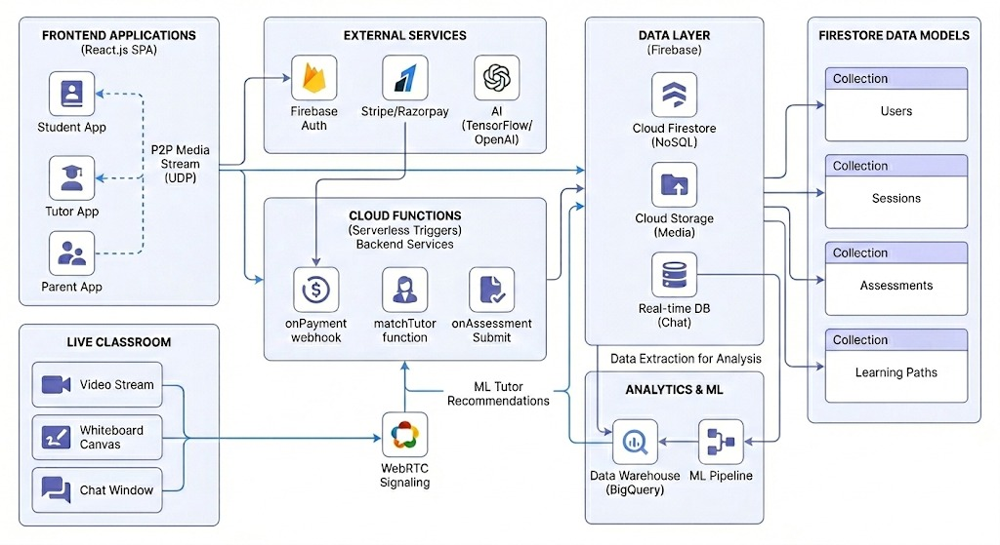

# Mentora

**Real-time peer tutoring platform with assessment-driven session lifecycle and performance-validated tutor ratings.**

---

## Problem

Students have no way to verify whether a tutoring session produced measurable learning. Tutors lack objective proof of teaching effectiveness — ratings are purely subjective. Parents are entirely excluded from the loop: no session visibility, no progress data, no spending oversight.

Existing platforms match on keywords and availability, not outcomes. Payment flows are decoupled from session state, leading to disputes. There is no enforced structure — sessions begin and end informally with no accountability checkpoints.

---

## Solution

Mentora wraps every session in a pre-test and post-test assessment cycle. The score delta feeds directly into a weighted tutor rating, producing an objective quality signal alongside subjective feedback.

Sessions follow a strict six-state lifecycle. Transitions are gated: tutor acceptance triggers payment, payment unlocks classroom entry, session end triggers assessment. Three role-scoped interfaces (Student, Tutor, Parent) enforce access boundaries across client, server, and database layers.

---

## Key Features

### Student
- Topic selection with pre-session assessment
- On-demand or scheduled tutor matching
- Stripe-gated payment before classroom entry
- WebRTC live classroom with video, whiteboard, and chat
- Post-session assessment with score delta tracking
- Progress dashboard with historical score trends

### Tutor
- Competency verification quiz for role activation
- Subject and availability configuration
- Real-time session request queue with accept/decline
- Wallet tracking and session price configuration
- Aggregate rating backed by weighted performance algorithm
- In-session document upload and sharing

### Parent
- Student account linking with unique code
- Real-time session status 
- Question-level pre vs post performance breakdown
- Cumulative financial summary across all sessions
- Session history with tutor, topic, and duration
- Tutor review audit of student-submitted ratings

---

## System Architecture



The client is a Next.js application serving three role-scoped interfaces. Firebase Authentication handles identity; Firestore manages all persistent and real-time state. An Express.js backend runs Firebase Admin SDK for privileged operations and server-side validation.

Payments flow through Stripe with status updates propagating to Firestore session documents. WebRTC signaling is coordinated through Firestore for peer-to-peer video sessions. Role enforcement is applied at the routing layer, API middleware, and database rules.

---

## Session Lifecycle

| State | Trigger |
|---|---|
| `searching` | Student creates session request |
| `pending_payment` | Tutor accepts; payment gate presented |
| `paid_waiting` | Payment confirmed; join button unlocked |
| `in_progress` | Both participants in classroom; timer active |
| `completed` | Timer expires or manual end; post-assessment triggered |
| `cancelled` | Timeout, payment failure, or explicit cancellation |

Transitions are unidirectional and event-driven. `cancelled` is reachable from `searching`, `pending_payment`, and `paid_waiting` only. Sessions that enter the classroom always have a verified payment and always reach a terminal state.

---

## Rating Algorithm

Each session produces two assessment scores. The delta is normalized and combined with the student's star rating:

```
scoreDelta = postTestScore - preTestScore

finalRating = (0.6 * studentStarRating) + (0.4 * normalizedScoreDelta)
```

The 60/40 weighting keeps satisfaction primary while anchoring ratings to measurable improvement. Over time, aggregate ratings converge toward values that reflect both teaching quality and actual student improvement.

---

## Data Model Overview

Four Firestore collections support the full lifecycle. **Users** stores identity, roles, and role-specific data (student profile, tutor qualifications, parent links) in a single denormalized document per user.

**Sessions** is the central coordination entity — tracks participants, topic, lifecycle status, payment state, and references to assessments and ratings. **Assessments** stores pre and post quiz attempts with full question-level detail. **Ratings** captures star ratings, feedback text, both test scores, computed delta, and the final weighted rating.

---

## Security Model

Firebase Authentication issues ID tokens attached to all API requests. Role-based access is enforced at three layers: client route guards, server middleware, and Firestore rules.

Parent-child linking is validated bidirectionally — both accounts must confirm the association before data access is granted. Payment gating checks session status before allowing WebRTC initialization. Session membership is validated by matching the connecting user's UID against the session's participant fields.

---

## Local Setup

### Server
```bash
cd server
npm install
cp .env.example .env    # Configure Firebase Admin + Stripe credentials
npm run dev
```

### Client
```bash
cd client
npm install
# Create .env.local with Firebase client config
npm run dev
```

---

## Future Scope

- Weighted tutor matching using historical score deltas and subject expertise
- Predictive analytics to identify at-risk students from assessment trends
- Exportable PDF session reports with question-level breakdowns
- Session recording and playback for asynchronous review
- Rate limiting and abuse detection on session creation endpoints

---

## Why This Wins

Every session passes through a deterministic state machine with payment-gated entry. Every tutor rating is backed by measurable pre-to-post assessment data. Parents receive real-time session status and granular performance breakdowns without polling.

The system enforces access boundaries at every layer — routing, API, and database. The result is a tutoring platform where quality is verifiable, progress is quantified, and accountability is structural.
